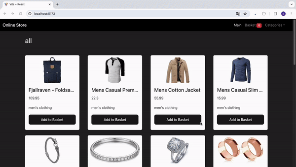

<h1>ONLINE STORE</h1>

Using Vite + React and React Router DOM, I have created an e-commerce website. When you add a product to your basket, the message "Product successfully added" appears on the right side of your screen. If you add the same product to your basket again, the message "Quantity increased" will appear. If you want to remove the product from your basket, the message "Product Removed from Basket" will appear on the right side of the screen. You can also filter products by your desired category in the "Categories" section.

<h2> Software Languages </h2>

- HTML

- CSS

- JavaScript

<h2> Libraries </h2>

- React

- React Router DOM

<h2> Development Tools </h2>

- Vite

<h2> Frameworks </h2>

- Bootstrap

<h2> Screen Gif </h2>

